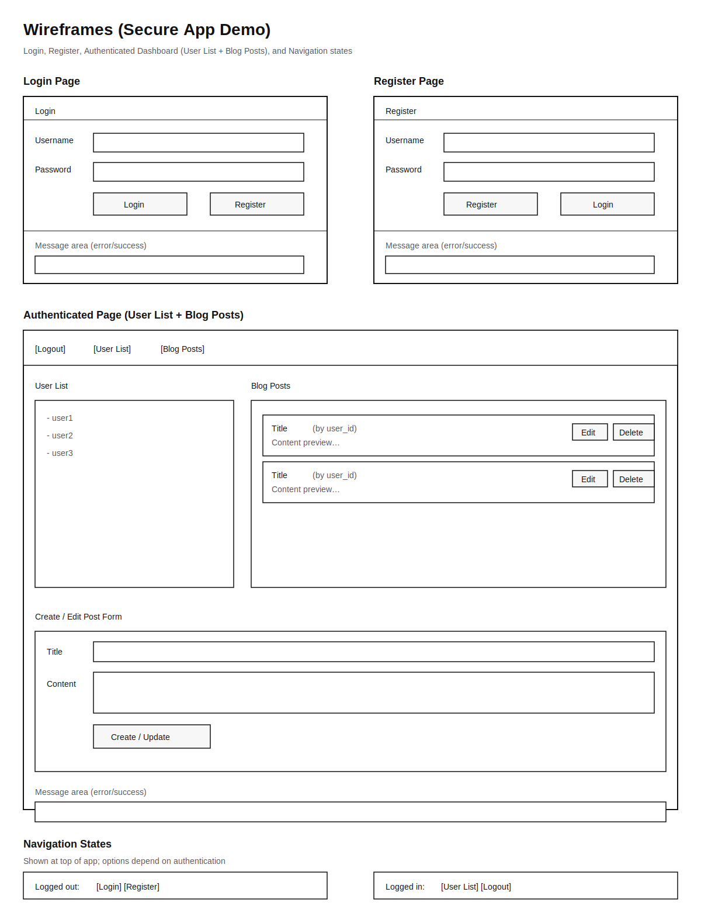
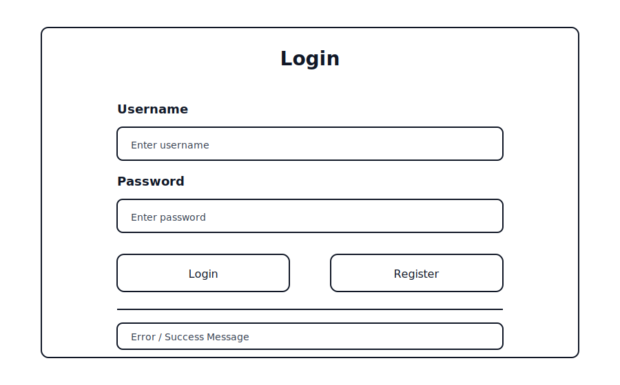

# Secure Application Programming Project Documentation

## Table of Contents
1. Software Development Lifecycle Methodology
2. Introduction
3. Software Requirement Specification
	- General Description
	- Requirements
	- Functional Requirements
	- Non-Functional Requirements
	- Data Classification
4. Entity Relation Diagram (ERD)
5. Technical Specification
	- High-Level Architectural Diagram
	- Wireframes
6. Use-Case Diagram
7. Use-Case Description
8. Class Diagram
9. Sequence Diagram
10. Testing Plan
11. Discussion on the Insecure Code
12. Discussion on the Secure Code
13. Ethics Question
14. Appendix A: Breakdown of Marks
15. Appendix B

---

## 1. Software Development Lifecycle Methodology
### Models Compared: Agile vs. Iterative

**Agile Model:**
- Focuses on flexibility, collaboration, and iterative development.
- Frequent feedback and adaptation to change.
- Supports continuous integration, testing, and secure coding practices.
- Ideal for projects with evolving requirements and security needs.

**Iterative Model:**
- Develops the application in repeated cycles (iterations).
- Each cycle adds features and refines the product.
- Good for gradually introducing and fixing vulnerabilities.
- Allows for incremental improvement and testing.

**Justification:**
Agile is chosen for this project because it enables rapid response to feedback, supports secure coding practices, and allows for continuous testing and improvement. This aligns with the project’s requirements for secure/insecure code comparison, thorough testing, and ethical review.

## 2. Introduction
In this project, an open-source web application is developed using Node.js with Express for the backend and React for the frontend. The database is SQLite3. The application demonstrates both vulnerable (insecure) and secure coding practices, focusing on SQL Injection, XSS, and Sensitive Data Exposure. Two implementations are provided: an insecure version (with vulnerabilities) and a secure version (with mitigations and security features).

## Technical Overview

This project is a full-stack web application built with a React frontend, an Express.js backend, and a SQLite3 database. The backend exposes both secure and intentionally insecure RESTful API endpoints to demonstrate common web vulnerabilities (such as SQL Injection, XSS, and Sensitive Data Exposure) and their mitigations. Security features in the secure implementation include:

- JWT-based authentication (stateless, token in localStorage)
- CSRF protection (using csurf middleware)
- Security headers (Helmet)
- Request logging (Morgan)
- Input validation and output encoding
- Password hashing (bcrypt)
- CORS with credentials for frontend-backend communication
- Secure /users endpoint (returns only id and username, requires authentication)

The application is designed for educational purposes, focusing on secure coding practices, vulnerability demonstration, and clear documentation rather than UI/UX design. The codebase is maintained in two branches: `secure` (active, with all secure features enabled) and `insecure` (with vulnerabilities for demonstration). Only one branch should be active at a time for assessment.
### Secure Endpoints Summary

- `/register` (POST): Register a new user (CSRF protected, password hashed)
- `/login` (POST): Authenticate user, returns JWT token (CSRF protected)
- `/logout` (POST): Instructs client to remove JWT (CSRF protected)
- `/users` (GET): Returns all users (id, username only, requires authentication)
- `/posts` (GET, POST, PUT, DELETE): CRUD for blog posts (requires authentication, CSRF protected for write operations)

All secure endpoints require proper authentication and CSRF tokens where appropriate. Insecure endpoints are commented out in the secure branch.

## 3. Software Requirement Specification

### General Description
This project is a simple blog platform web application. Users can register, log in, and create, edit, or delete their own blog posts. The application is designed to demonstrate both insecure and secure coding practices, specifically focusing on SQL Injection, Cross-Site Scripting (XSS), and Sensitive Data Exposure vulnerabilities. There are two main versions: an insecure version (with vulnerabilities intentionally left in) and a secure version (with mitigations and best practices applied).

### Requirements
**Product Scope:**
- The application allows users to create an account, log in, and manage their own blog posts.
- Users can create, view, edit, and delete blog posts.
- The insecure version demonstrates vulnerabilities (SQL Injection, XSS, Sensitive Data Exposure).
- The secure version mitigates these vulnerabilities and adds security features (CSRF protection, session management, security headers, logging, and monitoring).
- The application does not include advanced features such as comments, media uploads, or user roles beyond basic authentication.
- The UI is kept simple to focus on secure programming concepts rather than design or UX.

### Functional Requirements
- User authentication (login/register)
- Create, edit, and delete blog posts
- Demonstrate vulnerabilities (SQL Injection, XSS, Sensitive Data Exposure)
- Secure versions of all features
- Logging and monitoring

### Non-Functional Requirements
- Usability: Intuitive UI, clear error messages
- Performance: Responsive interface, efficient queries
- Security: OWASP Top 10 compliance, secure coding standards
- Reliability: Error handling, data validation

### Data Classification
| Type of Data                  | Basis for Collection                | Security Features (Secure Version)           |
|------------------------------|-------------------------------------|----------------------------------------------|
| Username, Password           | User authentication and access      | Passwords hashed (bcrypt), HTTPS, input validation |
| Blog Post Content, Title     | User-generated content              | Input validation, output encoding, XSS protection |
| Session Token (JWT)          | Session management                  | Secure token storage, HTTP-only cookies, CSRF protection |
| Logs (login, actions, errors)| Monitoring and auditing             | Access controls, log sanitization, monitoring |

Sensitive data (e.g., passwords) is never stored in plaintext. The application is designed to comply with data protection principles such as the GDPR, ensuring users can request deletion of their data. Only minimal personal data is collected, and all sensitive operations are protected in the secure version.

## 4. Entity Relation Diagram (ERD)
*Insert ERD diagram and explanation here.*

## 5. Technical Specification

High-Level Architectural Diagram

+-------------------+         HTTP(S)         +-------------------+         SQL         +-------------------+
|    React Frontend | <--------------------> |  Express.js API   | <----------------> |   SQLite3 DB      |
|  (JavaScript, JSX)|   RESTful API calls    | (Node.js, Helmet, |   SQL Queries     | (File-based DB)   |
|                   |                       |  Morgan, csurf,   |                  |                   |
| - User Interface  |                       |  JWT, bcrypt)     |                  |                   |
+-------------------+                       +-------------------+                  +-------------------+

**Description:**
- **React Frontend** (http://localhost:3000):
	- Provides the user interface for registration, login, and blog post management.
	- Communicates with the backend exclusively via RESTful API calls using the Fetch API.
	- Handles CSRF tokens and authentication tokens (JWT) as provided by the backend.

- **Express.js Backend** (Node.js, http://localhost:4000):
	- Exposes both secure and intentionally insecure REST API endpoints for demonstration and assessment.
	- Secure endpoints implement:
		- JWT-based authentication (stateless, HTTP-only cookies)
		- CSRF protection (using csurf middleware)
		- Security headers (Helmet)
		- Request logging (Morgan)
		- Input validation and output encoding
		- Password hashing (bcrypt)
		- CORS with credentials for frontend-backend communication
	- Insecure endpoints deliberately omit these protections to demonstrate vulnerabilities (e.g., SQL Injection, XSS, plaintext passwords).
	- Only the backend accesses the database directly; the frontend never interacts with the database.

- **SQLite3 Database**:
	- Stores user credentials (with hashed passwords in the secure version) and blog post data.
	- Is file-based and only accessible by the backend server.
	- No direct access from the frontend or external clients.

- **Security Boundaries & Data Flow:**
	- All sensitive operations (authentication, data storage, business logic) are handled by the backend.
	- The frontend never receives or stores plaintext passwords or sensitive data.
	- Security features (authentication, CSRF, headers, logging) are enforced only on secure endpoints; insecure endpoints are available for educational testing and demonstration.
	- The application is designed to clearly separate secure and insecure code for assessment and learning purposes.

### Wireframes

Login Page

-----------------------------
|        Login              |
|---------------------------|
| Username: [___________]   |
| Password: [___________]   |
| [ Login ]   [ Register ]  |
|---------------------------|
| [Error/Success Message]   |
-----------------------------

Register Page

-----------------------------
|      Register             |
|---------------------------|
| Username: [___________]   |
| Password: [___________]   |
| [ Register ]   [ Login ]  |
|---------------------------|
| [Error/Success Message]   |
-----------------------------

User List & Blog Posts Page (after login)

---------------------------------------------------
|  [Logout]   [User List]   [Blog Posts]           |
|-------------------------------------------------|
| User List:                                      |
|  - user1                                        |
|  - user2                                        |
|-------------------------------------------------|
| Blog Posts:                                     |
|  [Title] by User [id]: [Content]                |
|  [Edit] [Delete]                                |
|-------------------------------------------------|
| [Create/Edit Post Form]                         |
| Title:    [___________]                         |
| Content:  [___________]                         |
| [Create/Update Post]                            |
|-------------------------------------------------|
| [Error/Success Message]                         |
---------------------------------------------------

Navigation (all pages)

-----------------------------
| [Login] [Register]         |
| (if not authenticated)     |
| [User List] [Logout]       |
| (if authenticated)         |
-----------------------------

## 6. Use-Case Diagram
*Insert use-case diagram here.*

## 7. Use-Case Description
*Provide use-case descriptions using the template provided in your brief.*

## 8. Class Diagram
*Insert class diagram and explain design patterns used (e.g., Singleton, Observer, DRY, SOLID).* 

## 9. Sequence Diagram
*Insert sequence diagram and describe the sequence of messages.*

## 10. Testing Plan
*Describe the testing plan, tools used (Selenium, ZAP), and results.*

## 11. Discussion on the Insecure Code
- Explain and illustrate SQL Injection, XSS, and Sensitive Data Exposure vulnerabilities.
- Reference OWASP Top 10.
- Provide code and screenshots.

## 12. Discussion on the Secure Code
- Explain how vulnerabilities were mitigated (OWASP Cheat Sheets, security headers, CSRF, session management, logging, monitoring).
- Provide code and screenshots.

## 13. Ethics Question
*Discuss three Software Engineering Code of Ethics principles and actions taken regarding discovered vulnerabilities.*

## 14. Appendix A: Breakdown of Marks
| Section | Description | % mark |
|---------|-------------|--------|
| 1 | Software Development Lifecycle justification | 10% |
| 2 | Software Requirement Specification | 20% |
| 3 | The Use of GitHub for code and project planning | 5% |
| 4 | Discussion of Insecure code implementation | 20% |
| 5 | Discussion of Secure code implementation | 20% |
| 6 | Testing Documentation and results | 10% |
| 7 | Short video demonstrating your project | 5% |
| 8 | Ethics | 10% |

## 15. Appendix B
- Link to GitHub: [YOUR_GITHUB_REPO_URL_HERE] (branch: secure)
- Link to Video Demonstration:

---

*References to be added in formal academic style as required.*

*Use this document to compile all required sections for your final submission.*

